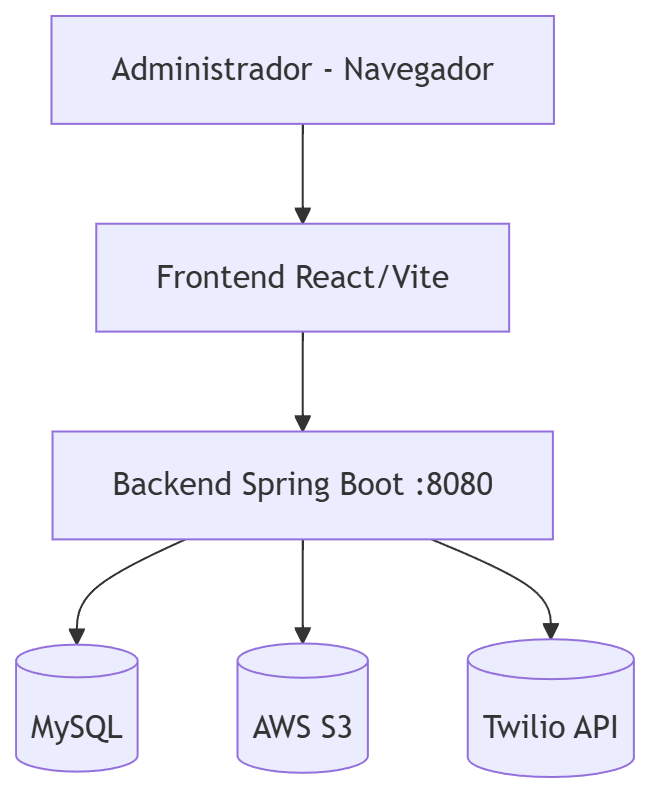

# Sistema de Alquiler de Habitaciones - API REST

Este proyecto es una **API RESTful** diseñada para gestionar el alquiler de habitaciones. La API permite registrar inquilinos, habitaciones, generar recibos de alquiler, y subir/descargar documentos relacionados con los inquilinos, como copias del DNI, utilizando **Amazon S3** como almacenamiento.

## Tabla de contenido

- [Características](#características)
- [Arquitectura](#arquitectura)
- [Tecnologías](#tecnologías-utilizadas)
- [Pre Requisitos](#pre-requisitos)
- [Instalación](#instalación)
- [API Endpoints](#endpoints-principales-del-API)
- [Seguridad](#seguridad-implementada)
- [Configuración CORS](#configuración-de-CORS)
- [Base de Datos](#base-de-datos)
- [Estructura del proyecto](#estructura-del-proyecto)
- [Autor](#autor)
- [Licencia](#licencia)

## ✨ Características

- Autenticación y autorización con **JWT**.
- Gestión CRUD de:
    - Inquilinos
    - Habitaciones
    - Alquileres
    - Recibos
- Gestión documental con **AWS S3**:
    - DNI de inquilinos
    - PDF de recibos
- Generación de recibos en PDF.
- Envío de recibos por **WhatsApp** mediante Twilio.
- Seguridad stateless con Spring Security.

## 🏛️ Arquitectura

API REST organizada en capas:

- **Controllers**: Exposición de endpoints HTTP.
- **Services**: Lógica de negocio.
- **Repositories**: Persistencia con Spring Data JPA.
- **Security**: JWT filter chain y políticas de acceso.
- **Integraciones externas**: AWS S3 y Twilio API.

## 🏗️ Arquitectura de despliegue




## 🛠️ Tecnologías Utilizadas

- **Java 17**
- **Spring Boot 3.x** 
  - Spring Web
  - Spring Data JPA
  - Spring Security con JWT
- **MySQL** como base de datos
- **AWS S3** para almacenamiento de archivos
- **Docker** para contenedores (opcional para la base de datos)
- **Postman** para pruebas
- **Git** para control de versiones
- **Twilio** para envío de mensajes de WhatsApp

## ✅ Pre requisitos

Asegúrate de tener instalados:

- **Java 17** o superior 
- **Maven**
- **Docker** (opcional, para la base de datos)
- **Cuenta de AWS** con un bucket S3 configurado
- **Cuenta de Twilio** para el envío de mensajes de WhatsApp (opcional)
- **Archivo `.env`** con las siguientes variables de entorno:

```properties
BUCKET_NAME=nombre-del-bucket
REGION=us-east-1
AWS_KEY_ID=tu-access-key
AWS_SECRET_KEY=tu-secret-key
```
## ⚙️ Instalación

1. Clona el repositorio:
   
   ```git
   git clone https://github.com/tuusuario/sistema-alquiler-habitaciones.git
   ```
   
2. Configura el archivo `.env` en el directorio raíz:
   
    ```env
    BUCKET_NAME=nombre-del-bucket
    REGION=us-east-1
    AWS_KEY_ID=tu-access-key
    AWS_SECRET_KEY=tu-secret-key
    ```
    
3. Compila el proyecto:
   
   ```bash
   mvn clean install
   ```
   
4. Inicia el servidor:
   
    ```bash
   mvn spring-boot:run
   ```
    
5. (Opcional) Inicia la base de datos con Docker:
    
   ```bash
   docker-compose up -d
   ```
## 🔌 Endpoints principales del API
### Autenticación y Usuarios

| Método   | Endpoint      | Descripción     |  Autenticación     |
|:------------|:-----------|:------------|:------------|
| `POST`     | `/auth/register`     | Registro de un nuevo usuario     |No     |
| `POST`   | `/auth/login`   | Autenticación y generación de un JWT Token   |No   |
| `GET`   | `/api/all-users`   | Ver todos los usuarios registrados	   |Sí (JWT)   |

### Habitaciones e inquilinos

| Método   | Endpoint      | Descripción     |  Autenticación     |
|:------------|:-----------|:------------|:------------|
| `GET`     | `/api/habitaciones`     | Listar todas las habitaciones     |Sí (JWT)     |
| `POST`   | `/api/habitaciones	`   | Registrar una nueva habitación   |Sí (JWT)   |
| `GET`   | `/api/inquilinos`   | Listar todos los inquilinos	   |Sí (JWT)   |
| `POST`   | `/api/inquilinos`   | Registrar un nuevo inquilino	   |Sí (JWT)   |

## Subida y Descarga de Archivos
 - **Subir archivo PDF (DNI del inquilino)**
     - **POST** `/api/files/upload`
     - **Params:** `dni=12345678`
     - **Body:** Archivo PDF como  `multipart/form-data`
 - **Descargar archivo PDF**
     - **GET** `/api/files/download`
     - **Params:** `dni=12345678`

## Ejemplo de Peticiones en Postman
**Subir archivo:**
  - **Método:** `POST`
  - **URL:** `http://localhost:8080/api/files/upload?dni=12345678`
  - **Headers:**
    
     ```bash
        Content-Type: multipart/form-data
      ```

 - **Body:**
   - **Tipo:** `form-data`
   - **Clave:** `file` (Archivo PDF)
     
**Descargar archivo:**
  - **Método:** `GET`
  - **URL:** `http://localhost:8080/api/files/upload?dni=12345678`

## 🔐 Seguridad implementada

La seguridad del sistema se basa en JWT (JSON Web Tokens) para proteger los endpoints. A continuación, se describen los pasos principales para interactuar con el sistema:

 1. **Registro de usuario:**
     - **POST** `/auth/register`
     - **Ejemplo en Postman:**

       ```JSON
            {
             "username": "usuario1",
             "password": "contraseña123"
            }
       ```
            
 2. **Login:**
     - **POST** `/auth/login`
     - **Respuesta exitosa:**
       
       ```JSON
            {
             "token": "eyJhbGciOiJIUzI1NiIsInR5cCI6IkpXVCJ9..."
            }
       ```
 3. **Acceso a endpoints protegidos:**
     - **Agrega el token como un header `Authorization` con el prefijo `Bearer`:**
       
       ```makefile
            Authorization: Bearer <tu_token_generado>
       ```
       

## Ejemplo de Peticiones en Postman
**Subir archivo:**
  - **Método:** `POST`
  - **URL:** `http://localhost:8080/api/files/upload?dni=12345678`
  - **Headers:**
    
     ```bash
        Content-Type: multipart/form-data
      ```

 - **Body:**
   - **Tipo:** `form-data`
   - **Clave:** `file` (Archivo PDF)
     
**Descargar archivo:**
  - **Método:** `GET`
  - **URL:** `http://localhost:8080/api/files/upload?dni=12345678`

## 🌐 Configuración de CORS
El sistema permite conexiones desde cualquier origen para desarrollo. La configuración se encuentra en `CorsConfig.java`:

```java
@Configuration
public class CorsConfig implements WebMvcConfigurer {
    @Override
    public void addCorsMappings(CorsRegistry registry) {
        registry.addMapping("/**")
                .allowedOrigins("http://localhost:8080") // Cambiar según el dominio
                .allowedMethods("*");
    }
}
```

## 🗄️ Base de Datos
El proyecto usa MySQL como base de datos. Si usas Docker, puedes inicializarla con el archivo `docker-compose.yml`. Credenciales de conexión configuradas en `application.properties`.

# 🧩 Estructura del Proyecto

El proyecto está organizado de la siguiente manera:

```plaintext
src/main/java/org/ricksnrz/apirest/apirestroom
├── Controllers
│   ├── AuthController.java
│   ├── UserController.java
│   ├── WhatsAppController.java
│   ├── AWS
│   │   ├── InquilinoAWS.java
│   │   └── ReciboAWS.java
│   └── CRUD
│       ├── InquilinoController.java
│       ├── HabitacionController.java
│       ├── AlquilerController.java
│       └── ReciboController.java
├── Services
├── Repositories
├── Entities
└── Security

 ```

## 👨‍💻 Autor
  - **Rick Kevin Saman Ramirez**
  - **Contacto:** rickx213@gmail.com

## 📄 Licencia
 Este proyecto está licenciado bajo la **MIT License** - consulta el archivo [LICENSE](LICENSE) para más detalles.
